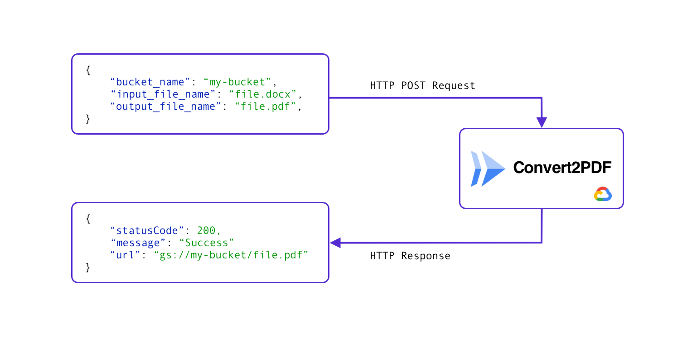

# Convert2PDF

This repository contains the implementation of an API to convert [MS Office Suite](https://apps.microsoft.com/detail/9mwk7rn11c5z?cid=majornelson) files to PDF. The followin image describes the Request and Response accepted and returned respectively from the API:



In addition, this repository contains the implementation of a service to summarize documents using GenAI, where a showcase is made on the call to the Convert2PDF API when the file is from the [MS Office Suite](https://apps.microsoft.com/detail/9mwk7rn11c5z?cid=majornelson).


# How to deploy the API in Google Cloud
This section explains the requirements and implementations necessary to deploy the API localized in `app/`.

1. **Authenticate**

The first step is to authenticate via `gcloud` as shown below:

    ```bash
    gcloud init
    gcloud auth application-default login
    ```

2. Initialize global variables
    ```bash
    PROJECT_ID="project-id" 
    REGION="us-central1" 
    ```

3. Create artifact registry to store images
    ```bash
    gcloud artifacts repositories create cloudrun-images \
    --repository-format=docker \
    --location=$REGION \
    --description="images for cloud run deploy" \
    --immutable-tags \
    --async
    ```

4. Configure permission to local docker to push to registry

    ```bash
    gcloud auth configure-docker $REGION-docker.pkg.dev
    ```

5. Build the images using Cloud Build

    ```bash
    gcloud builds submit --tag $REGION- docker.pkg.dev/$PROJECT_ID/cloudrun-images/convert2pdf:latest
    ```

6. Deploy the cloud Run API using the previous created image

    ```bash
    gcloud run deploy convert2pdf \
    --image $REGION-docker.pkg.dev/$PROJECT_ID/cloudrun-images/convert2pdf \
    --platform managed \
    --region $REGION \
    --allow-unauthenticated 
    ```

7. Test API

    ```bash
    curl -X POST \
    -H "Content-Type: application/json" \
    -d '{
        "input_bucket": "",
        "input_file": "",
        "output_bucket": "",
        "output_file": "" 
    }'  \
    https://convert2pdf-hl3pwu44oa-uc.a.run.app/convert2pdf
    ```

# Create Cloud function
**This section has to be reviewed**

1. create bucket for storing 
   
2. Create Pub Sub topic
   ```bash
    TOPIC_NAME="documents" 
    gcloud pubsub topics create $TOPIC_NAME    
   ```
3. Add notifications to the bucket created in step 2.
   ```bash
    BUCKET_NAME="bucket-flutter-app"

    gcloud storage buckets notifications create gs://$BUCKET_NAME --topic=$TOPIC_NAME    
   ```
4. Create Cloud function with 

    ```bash
    gcloud functions deploy fill_word_template \
    --project=$PROJECT_ID \
    --region=$REGION \
    --runtime python39 \
    --trigger-http \
    --source . \
    --entry-point fill_word_2_pdf \
    --set-env-vars "TEMPLATE_BUCKET_NAME=doc-ai-extractor-temp,TEMPLATE_FILE_NAME=convenio_confidencialidad.docx,OUTPUT_BUCKET_NAME=doc-ai-extractor-temp,PDF_CONVERTER_URL=https://convert2pdf-hl3pwu44oa-uc.a.run.app/convert2pdf" \
    --timeout 240s \
    --memory 512MB \
    --gen2
    ```


# References
- https://cloud.google.com/run/docs/building/containers
- https://cloud.google.com/artifact-registry/docs/docker/troubleshoot
- https://cloud.google.com/run/docs/deploying#gcloud
- https://github.com/sekR4/FastAPI-on-Google-Cloud-Run
- https://medium.com/@saverio3107/deploy-fastapi-with-docker-cloud-run-a-step-by-step-guide-a01c42df0fee